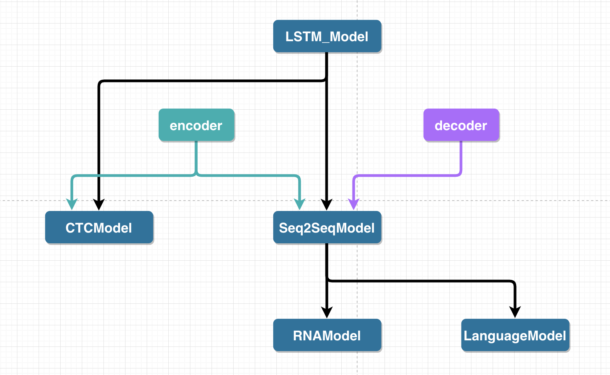

# coding standard
all the model files and utility files are here. We need to additionally prepare the project folder, where the batch loop and log pytho commands exist.

# Tools
## Data Tools
the dataset and dataloader class. They are iterable objects and return data in numpy forms.

## Config Tools
read the .yaml files
the `arguments.py` load the general configs into an object `args`. We process some parameters here.


# Models
<a href="/README.html" target="_blank">
  
</a>
## Seq2Seq Models
it has the encoder folder and decoder folder

## CTC Models
it uses the encoder folder

## RNA Model
it has the encoder-decoder framwork but use the ctc loss.

## Encoders
- conv_lstm_lh
if using blstm, the num_cell_units represent the sum of the two directions cell numbers.

# Projects
the projects has
- arguments.py
- datasets.py
- /models
- /exps

each data has a folder in the exp folder, which contains:
- /models
- /configs
- vocab.txt
if you run an experiment, you just need to enter the corresponding folder and run:
```python
python ../../main.py configs/standard.yaml
```
If you need to check the learing curve, you can run this command in the folder:
```python
tensorboard --logdir models --port 8888
```

# vocab
the 0-th is `<pad>`
the 1-th is `<unk>`
the last is `<blk>` for RNA and CTC(soon)
