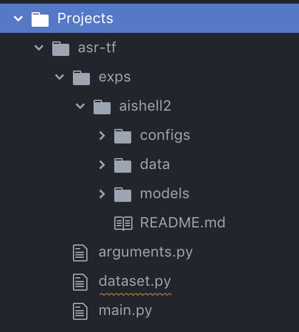

# An efficient end-to-end toolkit for ASR implemented with TensorFlow


## Install
For easy to edit, you donot need to install but add the path of 'eastonCode' to you PYTHONPATH.
```
PYTHONPATH=/path/to/eastonCode:$PYTHONPATH
```

## create exp dir
The experiments dir look like this:
<a href="/README.html" target="_blank">
  
</a>

`models` and `data` are empty for initialization, used to preserve saved models and data information, respectively. `configs` contains the `.yaml` files which are the configurations of the hyperparameters in your experiments.
We run the below commands under the specific exp dir (i.e. `aishell2`)

## How to use
- Configure your `.yaml` file
1. congfig your `vocab.txt`
    a) if you use attention (e.g. transformer model), you need to add `<sos>` and `<eos>`
    ```
    <pad>
    <unk>
    <sos>
    <eos>
    a
    b
    ...
    ```
    b) if use CTC like loss (e.g. CTC model), you need to add `<blk>` at end of the vocab file
    ```
    <pad>
    <unk>
    a
    b
    ...
    <blk>
    ```
2. set the unit in `.yaml`:
    - `word` is for the units that used in trans and split by space. Usually for Chinese characters and english words modelling units.
    - `char` is for character units where `<space>` is needed to add in the vocab.txt. The programes will merge chars into a word and replace `<space>` with ` ` (not recommend)
    - `subword` is used for subword where `@@` is in vocab units and will merge subwords into words.
1. Prepare wav and translation data
    Supporting wav file and `.ark` file which is the standard type in Kaldi.
    For efficiency, we need to convert the wav data to tf.data format first.
    Note the the trans is split by the space (i.e. ` `)
    a) if you use wav files, prepare your `csv` file, the `.yaml` file looks like this:
    ```
    train:
        data: /mnt/lustre/xushuang/easton/data/AISHELL-2/iOS/data/train_1kh_char.csv
        tfdata: /mnt/lustre/xushuang/easton/projects/asr-ctc-tf/exp/aishell/char_data/train
    dev:
        data: /mnt/lustre/xushuang/easton/data/AISHELL-2/iOS/dev/dev_char.csv
        tfdata: /mnt/lustre/xushuang/easton/projects/asr-ctc-tf/exp/aishell/char_data/dev
    test:
        # data: /mnt/lustre/xushuang/easton/data/AISHELL-2/iOS/test/test_char.csv
        data: /mnt/lustre/xushuang/easton/data/AISHELL-2/iOS/dev/dev_char.csv
    type: csv
    ...
    ```
    and `csv` file:
    ```
    /mnt/lustre/xushuang/easton/data/AISHELL-2/iOS/data/wav/C0001/IC0001W0001.wav,厨 房 用 具
    /mnt/lustre/xushuang/easton/data/AISHELL-2/iOS/data/wav/C0001/IC0001W0002.wav,电 蒸 锅
    /mnt/lustre/xushuang/easton/data/AISHELL-2/iOS/data/wav/C0001/IC0001W0003.wav,电 蒸 锅
    /mnt/lustre/xushuang/easton/data/AISHELL-2/iOS/data/wav/C0001/IC0001W0004.wav,嵌 入 式 灶 具
    /mnt/lustre/xushuang/easton/data/AISHELL-2/iOS/data/wav/C0001/IC0001W0005.wav,水 槽 洗 碗 机
    /mnt/lustre/xushuang/easton/data/AISHELL-2/iOS/data/wav/C0001/IC0001W0006.wav,宜 家 家 居 北 京 商 场 店
    ```
    b) if you use `scp` files, the `.yaml` file looks like this:
    ```
    train:
        data: /mnt/lustre/xushuang/easton/data/hkust/word/train/feats.train_3x.scp
        label: /mnt/lustre/xushuang/easton/data/hkust/word/train/word.train_3x.scp
        tfdata: /mnt/lustre/xushuang/easton/data/hkust/word/train
    dev:
        data: /mnt/lustre/xushuang/easton/data/hkust/word/train_dev/feats.train_dev.scp
        label: /mnt/lustre/xushuang/easton/data/hkust/word/train_dev/word.train_dev.scp
        tfdata: /mnt/lustre/xushuang/easton/data/hkust/word/train_dev
    test:
        data: /mnt/lustre/xushuang/easton/data/hkust/word/dev/feats.dev.scp
        label: /mnt/lustre/xushuang/easton/data/hkust/word/dev/word.dev.scp
        tfdata: /mnt/lustre/xushuang/easton/data/hkust/word/dev
    type: scp
    ```
    and `scp` file:
    ```
    20040615_154204_A001457_B001456-A-000000-000191 喂 你 好
    20040615_154204_A001457_B001456-A-000191-000541 [LAUGHTER] 请 问 你 是 哪 里 的 呀
    20040615_154204_A001457_B001456-A-000541-001137 [LAUGHTER] 我 也 是 吉 林 的 你 在 哪 个 学 校 上 学 呀
    20040615_154204_A001457_B001456-A-001137-001702 啊 我 也 是 [LAUGHTER] 那 咱 俩 是 校 友 啊
    20040615_154204_A001457_B001456-A-001702-001996 [LAUGHTER] 我 叫 马 帅
    20040615_154204_A001457_B001456-A-001996-002463 [NOISE]
    ```
    Demo yaml files can be found in `eastonCode/Projects/asr-tf/exps/aishell2/configs`.
2. Convert Data
    Transfer your audio data along with translations into tfdata for fast load during training. (Here the `dataset.py` is in top and top of the running path)
        ```python
        python ../../dataset.py -c configs/demo.yaml
        ```
3. Set Bucket
    Another thing this script will do is summarize the dataset and gives a proper bucket setting. This will iter your dataset. The bucket setting is related to your raw feature length and the frame skipping strategy (setting in your `.yaml`). So you need to reset you bucket boundary if you change them.
    if the recommand number of boundaries is low, you'd better enlarge the `idx_init` in the `dataset.py` and run the above command again (the data is already converted to tfdata, and you can commit the `save2tfrecord` to save time)
    Replace the original `bucket_boundaries` in the `.yaml` file with the recommend one.
    **NOTATION:** you need to update your bucket setting once you use new dataset or change frame rate (`downsample` in the config).

3. Train the model
    ```python
    python ../../main.py -c configs/demo.yaml
    ```
4. Infer with a trained model
    setting `checkpoint_init` and run:
    ```python
    python ../../main.py -m infer --gpu 0 -c configs/demo.yaml
    ```
# Model Implements
- Transformer
- CTC
- LAS
- Extended-RNA
- CTC-LM

# Results
## AIshell2
|Model| Discription | Cost | dev | test |
|:-----:|-------------|---|:-----:| :-----: |
| Transformer  |  6 blockes for each side; <br> skip 3 frames | 4 GPU/21h/55k steps| 8.8 | 8.5 |
|CTC   | CONV_BLSTM with 1600 hiddens states (800 for each direction); <br> confidence penalty 0.3 | 4 GPU/23h/33k steps |9.7  | |

## HKUST
|Model| Discription | Cost | train_dev | dev |
|:-----:|-------------|---|:-----:| :-----: |
| Transformer  |  6 blockes for each side; <br> skip 3 frames ; <br> num_heads 12; <br> l2-norm 1e-5; <br> attention_dropout: 0.0 ; <br> residual_dropout: 0.3| 4 GPU/20h/35k steps| 28.76 | 30.8 |
|CTC   | CONV_BLSTM with 1600 hiddens states (800 for each direction); <br> confidence penalty 0.3 | 4 GPU/14.5h/21.5k steps | 26.9  | 27.8 |

## LibriSpeech
|Model| Discription | Cost | dev-clean | test-clean |
|:-----:|-------------|---|:-----:| :-----: |
|CTC   | CONV_BLSTM with 1600 hiddens states (800 for each direction); <br> confidence penalty 0.3 | 4 GPU/1d2h/28k steps |  | 6.9 |


# Projects

the projects has
- arguments.py
- datasets.py
- /models
- /exps

each data has a folder in the exp folder, which contains:
- /models
- /configs
- vocab.txt
if you run an experiment, you just need to enter the corresponding folder and run:
```python
python ../../main.py configs/standard.yaml
```
If you need to check the learing curve, you can run this command in the folder:
```python
tensorboard --logdir models --port 8888
```

Please look Projects for more details.

# Coding Standard
all the model files and utility files are here. We need to additionally prepare the project folder, where the batch loop and log pytho commands exist.

# Acknowledgements
https://github.com/chqiwang/transformer
https://github.com/vrenkens/nabu
...
